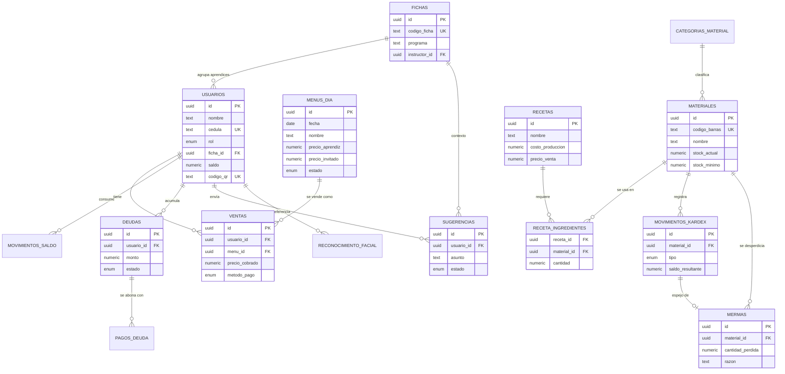

# Diseño de base de datos — GastroSENA / Sistema de Almuerzos SENA

Este documento resume lo que encontré revisando el prototipo en Figma Make (App.tsx, LoginScreen, DashboardEncargado, DashboardEstudiante, DashboardInventario) y propone un modelo relacional para reemplazar el `localStorage` actual por una base de datos real (pensado para PostgreSQL / Supabase, que es lo que Figma Make suele conectar).

El script SQL completo y listo para ejecutar está en `gastrosena_schema.sql`.

## 1. Qué hace hoy el prototipo (y por qué importa para el diseño)

Del código extraje estas estructuras que ya existen como datos "quemados" en el frontend:

- `Usuario`: id, nombre, rol (aprendiz/instructor/encargado/invitado), cedula, ficha, grupoId, saldo, precioAlmuerzo, codigoQR.
- `Grupo` (ficha): id, nombre, ficha, programa, estudiantesActivos, vocero, estudiantes[].
- `Estudiante` (dentro de un grupo): id, nombre, cedula, saldo, almuerzosConsumidos.
- Menú del día: nombre del plato, precio para aprendices, precio para invitados, cantidad disponible, historial de menús con ventas y estado.
- Deudas: nombre, tipo (instructor), cédula, ficha, deuda, almuerzos, días vencidos, estado (vencida/pendiente).
- Sugerencias: id, remitente, tipo, ficha, asunto, mensaje, fecha, estado (pendiente/atendida).
- Inventario GastroSENA — `Material`: id, codigo, nombre, categoria, unidadMedida, fechaVencimiento, stockActual, stockMinimo, estado (bueno/bajo/critico/venciendo).
- `Receta`: id, nombre, codigo, costoProduccion, precioVenta, ingredientes[] (materialId, cantidad, unidad, costo).
- `MovimientoKardex`: id, fecha, hora, usuario, concepto, tipo (entrada/salida/ajuste), cantidadEntrada, cantidadSalida, saldo, material.

Esto ya es, en esencia, un modelo de datos completo — solo falta pasarlo a tablas reales con relaciones e integridad referencial. Es una muy buena señal: no tuve que inventar el dominio, solo formalizarlo.

## 2. Diagrama entidad-relación

## 3. Los 6 bloques del modelo

**Usuarios y fichas.** Una tabla `usuarios` para los cuatro roles (con un `enum rol_usuario`, no cuatro tablas separadas — evita duplicar lógica de login/auth) y una tabla `fichas` para los grupos SENA. Cada aprendiz referencia su ficha con `ficha_id`; cada ficha referencia a su instructor. Nota de seguridad importante: el prototipo guarda usuarios y contraseñas en `localStorage`, lo cual es solo válido para la demo — en producción eso debe migrar a Supabase Auth (o al menos a contraseñas hasheadas con bcrypt/argon2, nunca texto plano).

**Menú y ventas.** `menus_dia` reemplaza el objeto quemado del menú del día, con precio diferenciado por rol (aprendiz/invitado) y estado (borrador/activo/agotado/completado) igual que en la UI. `ventas` es la tabla central: cada almuerzo servido es una fila, y de ahí salen tanto el reporte de "Ventas" del encargado como el "historial de fichas utilizadas" que ve el aprendiz — es la misma información vista desde dos ángulos, así que debe vivir en un solo lugar. Agregué `movimientos_saldo` como bitácora de la billetera (recargas, consumos, ajustes) porque `usuarios.saldo` por sí solo no te deja auditar qué pasó ni revertir un error.

**Cartera de deudas.** Tal como está en el prototipo ("Instructores con deudas pendientes"), pero generalizada a cualquier `usuario_id` por si mañana se permite deuda a otros roles. `dias_vencidos` no se guarda como columna: se calcula en la consulta (`current_date - fecha_origen`) para que nunca quede desincronizado del reloj real. Agregué `pagos_deuda` para poder registrar abonos parciales, algo que la UI actual no contempla pero que cualquier cartera real necesita tarde o temprano.

**Buzón de sugerencias.** Casi calcado del objeto que ya existe en el código (`remitente`, `tipo`, `ficha`, `asunto`, `mensaje`, `fecha`, `estado`), solo que `usuario_id` reemplaza el nombre de texto libre para poder hacer trazabilidad real.

**Inventario GastroSENA.** `materiales`, `recetas` y la tabla puente `receta_ingredientes` (una receta tiene muchos materiales, un material puede estar en muchas recetas — relación muchos-a-muchos con cantidad). El campo `estado` del material (bueno/bajo/crítico/venciendo) que se ve como badge de color en la UI **no lo guardaría como columna**: es 100% derivable de `stock_actual` vs `stock_minimo` y de `fecha_vencimiento`, así que lo dejé como ejemplo de `VIEW` en el SQL — evita el clásico bug de un stock que baja pero el badge se queda en verde porque nadie actualizó la columna de estado.

**Kardex y mermas.** `movimientos_kardex` es el historial completo de entradas/salidas/ajustes por material (igual que la pestaña "Kardex Ledger"), y `mermas` guarda el detalle humano (razón del desperdicio) que no tiene sentido meter en el kardex genérico — pero cada merma también debería generar su fila espejo en el kardex para que el saldo de stock cuadre siempre. Agregué `compras` / `compra_detalle` como extensión opcional para cuando quieran registrar entradas de proveedor con más detalle que un simple concepto de texto.

## 4. Decisiones de diseño que vale la pena que conozcas

- **UUID en vez de enteros autoincrementales** para todas las llaves primarias: es el estándar en Supabase y evita fugas de información (nadie puede adivinar "el usuario 4" incrementando un número en la URL).
- **Enums en vez de texto libre** para roles, estados y tipos de movimiento: los mismos valores que ya usa la UI (`'bueno' | 'bajo' | 'critico' | 'venciendo'`, `'pendiente' | 'atendida'`, etc.) quedan garantizados a nivel de base de datos, no solo en el frontend.
- **Nada de columnas calculadas que se puedan desincronizar**: estado de stock, días vencidos, etc. se calculan en consulta o con una vista, no se guardan.
- **Row Level Security (RLS)** si terminan usando Supabase: un aprendiz debe poder ver su propio saldo/ventas/sugerencias, pero no las de otros; el encargado ve todo. Dejé un ejemplo de política al final del script.
- **Reconocimiento facial**: el prototipo lo simula. Si en algún momento se implementa de verdad, no guardes la foto ni el embedding directamente en `usuarios` — usa la tabla `reconocimiento_facial` separada (y considera la extensión `pgvector` de Supabase para búsqueda por similitud).

## 5. Próximo paso sugerido

1. Correr `gastrosena_schema.sql` en un proyecto de Supabase (o cualquier Postgres 14+).
2. Migrar los arrays quemados del frontend (`gruposDelSena`, `materiales`, etc.) como datos semilla (`INSERT`) para no perder los datos de ejemplo mientras conectan el backend real.
3. Reemplazar `localStorage` en `LoginScreen.tsx` por llamadas a la base de datos (o a Supabase Auth) antes de considerar el login "listo para producción".
